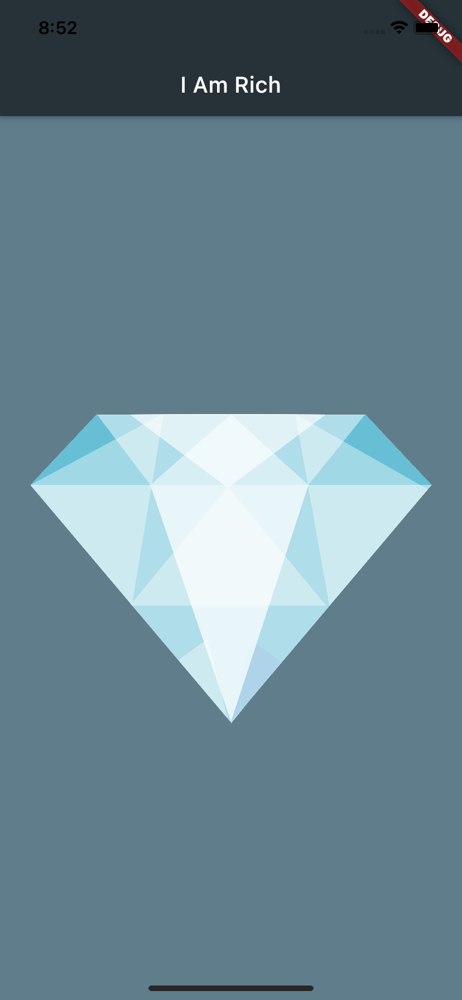

# I Am Rich app

|                        |
|:----------------------:|
|   |

## Creating Flutter app from scratch

What you'll come to notice while you're creating Flutter apps is that there are widgets that fulfill almost every role. 
You also have widgets that perform a variety of roles.
The text widget is responsible for displaying text and styling text.
The center widget is responsible for laying out the screen, helping to put something right in the center.

And the Material App is kind of like the grand daddy of all the widgets, because it usually sits at the
top and everything that we build is pretty much a Material App.

Well by installing Flutter and Dart packages, we automatically get access to a reformater called dartfmt.
The Flutter team advises that whenever you're creating a widget, which parentheses or round brackets, after every one of these, just add a
**comma**. 
Then we can use **reformat code with dartfmt** on right click menu that will prettify our code with indented structure.

## Scaffolding a Flutter app

### [Scaffold](https://api.flutter.dev/flutter/material/Scaffold-class.html)

Scaffold provides APIs for showing drawers and bottom sheets.

Scaffold is designed to be a top level container for a [MaterialApp](https://api.flutter.dev/flutter/material/MaterialApp-class.html). 
This means that adding a Scaffold to each route on a Material app will provide the app with Material's basic visual layout structure. 
It is typically not necessary to nest Scaffolds. 

For example, in a tabbed UI, where the [bottomNavigationBar](https://api.flutter.dev/flutter/material/BottomNavigationBar-class.html) is a [TabBar](https://api.flutter.dev/flutter/material/TabBar-class.html) and the body is a [TabBarView](https://api.flutter.dev/flutter/material/TabBarView-class.html), you might be tempted to make each tab bar view a scaffold with a differently titled AppBar. 
Rather, it would be better to add a listener to the [TabController](https://api.flutter.dev/flutter/material/TabController-class.html) that updates the AppBar

### [AppBar](https://api.flutter.dev/flutter/material/AppBar-class.html)

A material design app bar.

An app bar consists of a toolbar and potentially other widgets, such as a [TabBar](https://api.flutter.dev/flutter/material/TabBar-class.html) and a [FlexibleSpaceBar](https://api.flutter.dev/flutter/material/FlexibleSpaceBar-class.html). 
App bars are typically used in the [Scaffold.appBar](https://api.flutter.dev/flutter/material/Scaffold/appBar.html) property, which places the app bar as a fixed-height widget at the top of the screen.

The AppBar displays the toolbar widgets, leading, title, and actions, above the bottom (if any).

### [Image](https://api.flutter.dev/flutter/widgets/Image-class.html)

A widget that displays an image.

To make image asset usable, **pubspec.yaml** need to be updated by adding **assets** and its path:

~~~
flutter:
  assets:
    - images/
~~~

>NOTE
>>Be really carefull about indentation in **yaml** file. Yaml use  2-space indentation for parent-child relation.

## Setup App Icon

* Prepare icon image with 1024x1024 resolution.
* Go to appicon.co (or similar site) to get android and ios icon.
* For android: in android studio go to -> android-app-src-main-res -> Show in finder -> remove all folder with prefix 'mipmap' -> replace with downloaded 'mipmap' folders.
* For ios: in android studio go to -> ios-Runner -> Show in finder -> remove Assets.xcassets folder -> replace with downloaded Assets.xcassets folder

## Styling App Icon fo Android

* Go to -> android-app-src-main-res -> Right click -> New -> Image Asset
* This will open Configure Image Asset window.
* On Foreground Layer tab, find 'path' -> click folder icon.
* Pick icon image (the one with 1024x1024 resolution) -> Open
* Then you can resize the image to the preferred styling size.

### I Am Rich App Structure

[Material colors](https://material.io/design/color/the-color-system.html#tools-for-picking-colors)