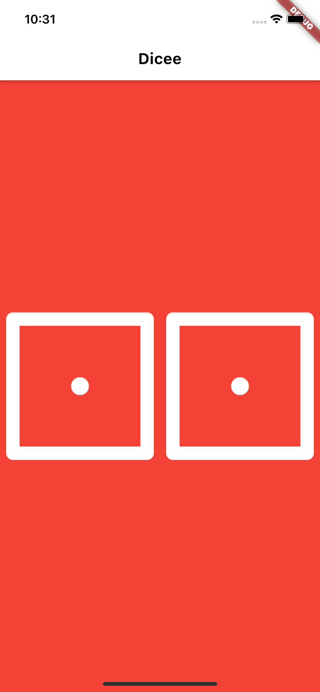
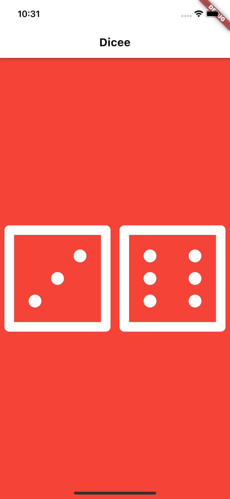

# Stateful App

|                        |                        |
|:----------------------:|:----------------------:|
|   |   |

## Using the Expanded Widget to Create Flexible Layouts

Expanded Widget is a widget that expands a child of a Row, Column, or Flex so that the child fills the available space.

[Expanded Widget](https://api.flutter.dev/flutter/widgets/Expanded-class.html)

## Intention Actions

Intention Actions can be pull put with shortcut option+return.

## Adding Gesture Detection with Flutter Button Widges

Buttons allow users to take actions, and make choices, with a single tap.

There are four types of material buttons: 
1. [Text button](https://api.flutter.dev/flutter/material/TextButton-class.html)
2. [Outlined button](https://api.flutter.dev/flutter/material/OutlinedButton-class.html)
3. Contained button
4. Toggle button

Text buttons are typically used for less-pronounced actions, including those located in dialogs and cards. In cards, text buttons help maintain an emphasis on card content.

[Material Buttons documentation](https://material.io/components/buttons#usage)

## Dart Functions - Part 1

### Anonymous Function

~~~
() {
    print('This is anonymous');
}
~~~

### Named Function

~~~
void getName() {
    print('My name is...');
}
~~~

## Making the Dice Image Change Reactively

We can add variable in the scope of class or widget.

~~~
class DicePage extends StatelessWidget {
  @override
  Widget build(BuildContext context) {
    var leftDiceNumber = 1;
    return Container(),
    );
  }
}
~~~

>NOTE
>>If you put variable outside Widget **build** scope, the hot reload wouldn't detect it changes.

## Dart Variables

~~~
var name = 'Fadhil'
void getName() {
    print('My name is $name');
}
~~~

## Dart Data Types

~~~
var name = 'Fadhil'
String strOnlyName = 'Fadhil'
~~~

[String](https://api.flutter.dev/flutter/dart-core/String-class.html)

~~~
var number = 1
int intOnly = 123
~~~

[int](https://api.flutter.dev/flutter/dart-core/int-class.html)

~~~
var isTrue = true
bool boolOnly = true
~~~

[bool](https://api.flutter.dev/flutter/dart-core/bool-class.html)

Dart also have dynamic type, **var** with no value will be a dynamic type

~~~
var a; // or dynamic a;
a = 1
a = 'a'
a = false
~~~

## Stateful vs. Stateless Widgets - What's the Difference?

[Stateless Widgets](https://api.flutter.dev/flutter/widgets/StatelessWidget-class.html) is a widget that does not require mutable state. The state in Stateless Widgets are not meant to change.

[Stateful Widgets](https://api.flutter.dev/flutter/widgets/StatefulWidget-class.html) is widget that has mutable state.

Shortcut for Stateful Widgets is **stful**.

There is two part of Stateful Widget: **Widget**, which is similar to the one in Stateless Widgets, and **State**.

Variable change need to happen inside **setState()**, it will then redraw widget with updated value.

~~~
...
onPressed: () {
  setState(() {
    leftDiceNumber = 6;
  });
},
...
~~~

## Randomising the Dice

To use random number we need to import dart:math library.

~~~
import 'dart:math';
~~~

[Random number](https://api.dart.dev/stable/2.12.2/dart-math/Random-class.html)

[Math Library](https://api.dart.dev/stable/2.12.2/dart-math/dart-math-library.html)